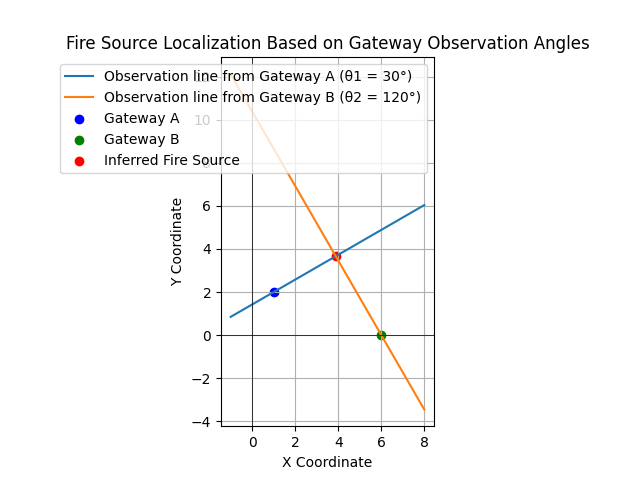

# 物联网网关火灾检测

## 硬件设计

参考 ForestProtector: An IoT Architecture Integrating  Machine Vision and Deep Reinforcement Learning  for Efficient Wildfire Monitoring，其中的网关板设计。

## 视觉算法

### 3DCNN

### YOLO

### MicroYOLO

## 位置判断

已知物联网网关 A 和 B 的位置和每个网关观测到的火源角度方向

A 点推导

$$
\tan(\theta_1) = \frac{(y - y_1)}{(x - x_1)} \Rightarrow y = \tan(\theta_1) \ast (x - x_1) + y_1
$$

对 B 点

$$
y = \tan(\theta_2) \ast (x - x_2) + y_2
$$

联立求解交点

$$
x = \frac{(y_2 - y_1 + x_1 \tan\theta_1 - x_2 \tan\theta_2)}{\tan\theta_1 - \tan\theta_2} \\
y = \tan\theta_1 \cdot (x - x_1) + y_1
$$