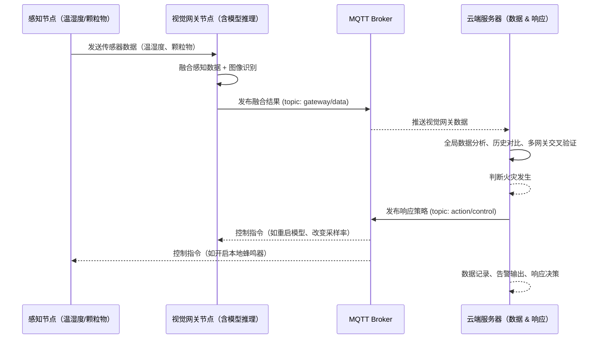

```mermaid
sequenceDiagram
    participant SensorNode as 感知节点（温湿度/颗粒物）
    participant VisionGateway as 视觉网关节点（含模型推理）
    participant MQTTBroker as MQTT Broker
    participant CloudServer as 云端服务器（数据 & 响应）

    SensorNode->>VisionGateway: 发送传感器数据（温湿度、颗粒物）
    VisionGateway->>VisionGateway: 融合感知数据 + 图像识别
    VisionGateway->>MQTTBroker: 发布融合结果 (topic: gateway/data)

    MQTTBroker-->>CloudServer: 推送视觉网关数据

    CloudServer->>CloudServer: 全局数据分析、历史对比、多网关交叉验证
    CloudServer-->>CloudServer: 判断火灾发生

    CloudServer->>MQTTBroker: 发布响应策略 (topic: action/control)
    MQTTBroker-->>VisionGateway: 控制指令（如重启模型、改变采样率）
    MQTTBroker-->>SensorNode: 控制指令（如开启本地蜂鸣器）

    CloudServer-->>CloudServer: 数据记录、告警输出、响应决策

```