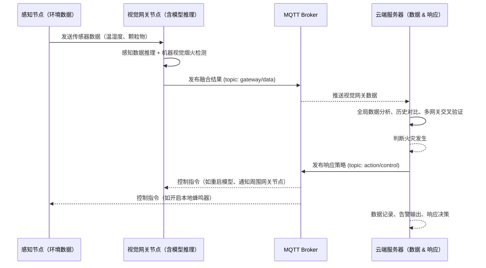

# 创新训练项目申报表

## 研究目的

### 研究背景

森林火灾作为一种破坏性极强的自然灾害，对生态环境和人类生命财产安全构成严重威胁。传统的森林火灾检测方法，如人工巡逻和固定式红外热像仪，存在覆盖范围有限、效率低下、易受环境因素干扰等弊端。早期的自动化检测系统，例如基于专家系统的方案，往往依赖于人为设定的简单规则，误报率高、适应性差，难以应对复杂多变的野外环境。

近年来，机器视觉技术在火灾检测领域展现出巨大潜力。然而，现有基于深度学习的火灾检测模型，特别是目标检测算法 YOLO 和针对视频序列分析的 3D 卷积神经网络等复杂架构，通常需要大量的计算资源和存储空间，难以直接部署在资源受限的物联网感知节点上。这导致了较高的部署成本和能耗，限制了其在广阔森林区域的实际应用。此外，传统的单一检测模式仅依赖单一类型传感器的数据或单一的视觉信息，容易受到环境干扰，导致检测准确性和可靠性不足。火灾发生后的精确定位仍然是一个挑战，往往依赖人工确认或复杂的地理信息系统分析，难以满足早期快速响应的需求。

### 研究目标

针对上述现有技术的关键问题，本研究旨在构建一个基于智能物联网的分布式森林火灾实时监测系统，通过多方面的创新，实现更高效、更准确、更可靠的森林火灾早期预警：

轻量化神经网络架构设计与优化： 针对现有深度学习模型算力需求大、部署成本高的问题，本研究将探索并提出轻量化的神经网络架构，例如对现有模型进行剪枝、量化、知识蒸馏等优化，或设计更高效的网络结构。目标是在满足火灾检测精度的前提下，显著降低模型的计算复杂度和存储需求，实现物联网节点的低功耗运行和高性能表现的平衡。

多模态传感器数据融合与协同分析： 突破传统单一检测模式的局限性，本研究将融合来自多种传感器的数据，包括温湿度、烟雾浓度等环境参数以及可见光和红外图像等机器视觉信息。通过设计有效的多模态数据融合算法，实现环境感知与视觉特征的协同分析，提升火灾检测的准确性和可靠性，减少误报和漏报。

物联网节点空间定位与网关视觉验证的联合火灾定位： 创新性地设计物联网节点与网关的协同工作机制。利用物联网节点的空间定位信息（如GPS或LoRa定位），结合网关搭载的视觉分析能力进行火灾区域的二次验证。通过节点初步告警和网关视觉确认的联合判断，实现火灾位置的精准定位，为快速响应和灭火指挥提供精确的地理信息。

低功耗边缘计算方案与实时响应系统构建： 开发适应野外环境的低功耗边缘计算方案，将轻量化模型部署在物联网节点或边缘网关上，实现本地化的实时数据处理和火灾检测。构建秒级响应的实时预警系统，将传统火灾检测的分钟级延迟大幅降低，为早期火灾预警和控制争取宝贵的时间窗口。

本项目的实施将推动物联网、人工智能和机器视觉技术在森林防火领域的深度融合与创新应用，为构建智能化、高效化的森林防灾减灾体系提供可扩展的技术解决方案，对保护森林资源和人民生命财产安全具有重要的现实意义。

## 研究内容

### 智能物联网感知网络的设计

本项目旨在研究并构建一个基于智能物联网的分布式森林火灾实时监测系统。系统将部署低功耗、小型化的物联网感知节点，用于实时采集森林环境数据，包括温度、湿度、烟雾浓度等多种参数。这些节点将通过低功耗广域网络或其他合适的无线通信协议，将数据传输至性能更强大的物联网网关。该网关将作为系统的核心处理单元，一方面负责接收和聚合来自多个感知节点的数据，另一方面将承担摄像头数据的摄入和复杂的机器视觉计算任务，以及对部分节点数据的集中分析。

针对物联网感知节点收集到的环境数据，本研究将创建一个轻量化的神经网络模型，该模型能够通过深度学习技术对时间序列传感器数据进行火灾风险推断。这种方法相较于传统的基于阈值的专家系统具有诸多优点，例如能够学习更复杂的火灾特征模式、对环境干扰具有更强的鲁棒性、并能实现更早期的火灾预警。同时，网关将利用其强大的计算能力，直接处理摄像头捕获的图像数据，采用先进的目标检测、图像分类等机器视觉算法，实时识别火焰和烟雾等火灾特征。节点侧的轻量化模型和网关侧的复杂视觉分析将形成互补的检测机制，共同提升系统的整体检测性能。

考虑到物联网感知节点普遍面临能耗受限的挑战，本项目在系统架构设计中充分体现“任务单一化 + 分层处理 + 按需激活”的能效优化原则。感知节点作为系统最底层单元，采用廉价、低功耗的器件，主要承担简单的数据采集与初步事件触发任务，例如温湿度、烟雾浓度特征的监测。此类节点不具备复杂计算能力，其采集数据将直接通过低功耗通信协议上传至相邻网关节点。

网关设备作为边缘计算中枢，具备更强的处理能力与视觉识别功能，通常处于低活跃或待机监测状态，以减少系统整体能耗。当某一感知节点上报的传感数据存在火灾可能性阈值时，相应网关将被定向激活，对节点所处区域进行视觉识别与验证。例如，当多个底层节点在某一区域同时上报异常数据时，网关将通过位置信息融合分析，主动开启该区域的视觉火灾检测模块，以确定火情真实性。这种机制保证了系统在大部分时间维持低功耗状态，仅在潜在异常发生时局部激活关键模块，从而达到按需响应、节能高效的目标。

此外，系统还设计了多网关联动机制。当某一区域的网关确认或高度怀疑存在火情时，将通过边缘网络主动广播火情信息至其邻近网关节点，协同其在边缘重叠区域进行交叉验证和边界识别。这种网关间的协同感知与自治验证机制不仅提升了火灾定位的空间鲁棒性，也有效降低了单点误报或漏报风险。

### 基于深度学习的节点侧火灾风险推断

为了满足低功耗、低延迟的边缘计算需求，节点侧的火灾检测模型需具备轻量化、快速响应的特点。本研究将针对传感器采集的温湿度、颗粒物浓度等时序环境数据，设计基于轻量神经网络的分类架构，实现对火灾发生风险的智能判断。

 最终模型部署于物联网感知节点，可实现低频率（如1Hz）周期性采样并执行本地化推理，快速识别火灾早期风险，并及时向上游网关传输警报信息。该机制将在保证系统功耗可控的前提下，实现可靠的早期预警能力，为后续视觉验证与定位分析提供先导信息。

### 基于机器视觉的网关侧火灾特征识别

考虑到图像数据蕴含丰富的火灾早期特征，如火焰形状、颜色变化及烟雾扩散等，项目将在计算资源相对充足的网关端部署图像识别模型，用于对火灾图像的分类、检测和定位。研究将以轻量化视觉模型（如YOLOv5s、microYOLO、MobileNet-SSD等）为基础，实现对火焰与烟雾目标的准确识别。

 为提升识别效果与实用性，视觉模型训练过程中将整合多个来源的真实火灾图像数据集，包含森林场景中不同天气与光照条件下的火焰与烟雾样本。此外，为模拟摄像头在野外安装角度的多样性，研究将加入视角变换、遮挡扰动等图像增强策略，提升模型在实际部署环境中的鲁棒性和适应性。

 网关将结合摄像头自身的旋转角度和地理位置信息，在发现视觉特征后对火灾方向进行初步判断，并与多个节点侧的预警信息进行交叉验证。这一视觉识别结果不仅作为节点检测的补充手段，也为火灾精准定位提供图像级支持，进一步提高系统整体的检测可靠性与实战应用价值。

### 云端数据与响应机制

为支撑森林火灾监测系统的高效协同与持续演化，本研究在系统架构中引入基于云计算的中央服务平台，作为感知网络与边缘网关的数据汇聚中心和响应指令的调度核心。该平台采用面向服务架构（SOA, Service-Oriented Architecture）设计思想，基于Spring框架构建模块化、可扩展的应用服务器，提供统一的数据接入接口与异步事件响应机制，确保系统具备良好的扩展性与可维护性。

在系统运行过程中，物联网感知节点与边缘网关所采集的结构化数据将通过轻量化通信协议（如MQTT/HTTP）上传至云端服务器。服务器后端设计中引入高内聚低耦合的微服务架构，各子模块分别负责数据接收、存储、解析、判定及响应策略的制定与下发。数据库层采用关系型数据库（如MySQL或PostgreSQL）进行历史数据的管理与持久化存储，同时配合缓存系统（如Redis）提升高频读写性能，支持海量时间序列数据的快速查询与溯源分析。

微服务间通信优化：使用Spring Cloud技术栈（包括Eureka服务注册发现、Feign声明式REST客户端以及Hystrix断路器等），实现微服务间的高效通信和容错处理。特别是在高并发场景下，通过负载均衡策略和熔断机制有效避免了单点故障，提升了系统的整体可用性。

异步处理与消息队列整合：考虑到实时数据处理的需求，我们将Spring WebFlux与RabbitMQ或Kafka等消息队列结合，实现了非阻塞I/O操作及事件驱动架构，提高了数据传输效率和系统响应速度。同时，通过消息确认机制保证了数据的一致性和完整性。

安全性增强：在Spring Security基础上，实施多层次的安全防护措施，包括但不限于OAuth2认证授权、JWT令牌管理以及敏感数据加密传输，确保数据安全和隐私保护。

结合Elasticsearch的快速搜索能力和Kibana的可视化功能进行实时监测预警以及历史数据分析：将传感器节点和边缘网关收集的数据进行索引，利用Elasticsearch的强大查询语言DSL执行复杂的查询操作，比如查找特定时间段内的所有火灾报警事件，或者计算某个区域内的平均温度。在Kibana中，您可以基于已有的索引模式创建新的可视化组件。比如，使用折线图展示过去一周内某地区的温度变化趋势。将多个可视化组件组合成一个仪表板，用于综合监控整个系统的运行状态。例如，一个仪表板可能包含火灾热点分布的地图、实时火情警报数量以及环境参数的变化曲线。

结合Prometheus与Grafana进行云端系统运行健康监测：使用Prometheus指定要监控的目标（如服务器、数据库等），设置不同的采集间隔时间，针对关键服务增加采集频率。在Alertmanager中设置告警规则，当某些指标超出设定阈值时触发告警。告警可以通过电子邮件、Slack等多种方式通知相关人员。使用Grafana创建新的数据源连接到Prometheus，并根据需求设计图表类型（如表盘图显示CPU利用率，柱状图比较不同节点间的内存消耗）。组合这些图表形成全面的监控视图，便于一目了然地掌握系统健康状况，持续监控服务器资源使用情况（CPU、内存、磁盘I/O）、网络流量及应用服务响应时间等，及时发现并解决问题，并且能够总结找出可能导致性能瓶颈的因素，指导系统优化工作。

对于边缘传感器与网关节点的运行状况监测，可以使用Node Exporter或根据具体需要开发自定义exporter。例如，编写脚本定期收集如CPU使用率、内存占用、电池电量等关键指标，并以Prometheus兼容格式输出（通常是HTTP服务形式）。利用MQTT协议作为桥梁。边缘设备可以通过MQTT发布其健康状态信息到特定的主题，而在云端部署一个MQTT-to-Prometheus桥接器，订阅这些主题并将消息转换为Prometheus可理解的格式存储起来，而后可以被云端的Prometheus拉取数据。这样便可以建立一个完整的从边缘到云端的系统健康监控体系，使得即使在资源受限的情况下，也能有效地监控和管理大量分散的边缘物联网节点/网关。

云端平台不仅承担了数据中心的角色，还通过集成风险评估与响应策略模型，实现面向全局的智能调度与事件响应功能。平台将结合多源数据的空间分布与时间演化特征，实时生成火灾风险热力图，判断火情等级并向对应区域的网关或管理终端发送预警指令。云端的调度模块还可根据节点上报频次、异常程度以及空间权重，动态调整数据上传策略与模型调用频率，降低整体能耗的同时提升系统的响应效率与容错能力。

此外，系统支持通过可视化Web端监控界面对全域数据状态进行实时展示，辅助林业管理部门实现远程监控、故障诊断与数据驱动的决策支持。未来可通过集成大模型API或联邦学习机制，进一步拓展云端智能分析能力，形成“边缘智能-云端大脑”协同工作的火灾防控系统。

## 国内外研究现状和发展动态

### 机器视觉在物联网中的应用

随着深度学习技术的发展，基于神经网络的机器视觉方法正逐步成为森林火灾检测的重要手段。Redmon 等人提出的 YOLO（You Only Look Once）系列算法，以其单阶段检测机制在实时目标检测中展现出优越性能，成为该领域的经典代表 。Edwin 等人则通过 3D 卷积神经网络对摄像头捕获的视频序列进行时空特征建模，有效识别烟雾动态，提升了火灾检测的时效性与准确率。

尽管这些方法在实验环境中均可实现 90% 以上的检测准确率，但其模型参数量大、计算复杂，难以直接部署在资源受限的边缘设备上。为解决这一问题，Deutel 等人提出了极端轻量化的 $\mu$YOLO（microYOLO），在 128×128 分辨率下实现了 3.5 FPS 的检测帧率，验证了其在微控制器上的可部署性，尽管在检测精度方面有所牺牲 。

为了在保持准确率的同时降低计算复杂度，Howard 等人设计了 MobileNets 架构，引入深度可分离卷积，显著减少模型参数量和计算负载（降低约 8–9 倍），为嵌入式视觉系统提供了一种高效解决方案 。此外，Bonilla-Ormachea 等人在 ForestProtector 项目中，结合机器视觉与深度强化学习，构建了面向森林监测的端到端物联网架构，进一步展示了机器视觉在实际场景下的部署潜力 。

### 当前发展所面临的挑战

高性能视觉模型通常伴随着大量的计算开销与内存占用，而边缘设备（如微控制器、嵌入式系统）在算力、存储、功耗方面高度受限。尽管如 microYOLO 等模型已实现了在极端设备上的运行，但依然存在检测精度不稳定、类别泛化能力不足等问题 。如何在轻量化和准确率之间取得更优的平衡，是轻量神经网络设计的核心难题。

森林火灾检测往往依赖多种传感器（如温湿度传感器、红外、可见光摄像头等）协同工作，而将图像信息与其他模态数据（如气象、烟雾浓度）进行实时融合，需要设计合理的数据表示与联合学习机制。目前，多模态融合算法仍以实验性探索为主，实际部署中面临同步性差、融合方式不通用的问题。

在偏远森林区域，通信网络带宽有限且不稳定，视频或图像数据上传常受限，因此需要就地分析并仅上传警报结果。然而视觉分析任务本身计算密集，对电池供电的设备而言可能导致能耗快速上升。因此，需要在火灾检测准确性和整体网络能耗之间建立高效调度与管理机制 。

机器学习中训练数据对模型决策有很大影响，而目前存在实验地验证数据不足和不同环境下的模型迁移问题。目前多数研究仍停留在公开数据集上进行模型验证，缺乏足够多样的野外场景数据支持模型泛化。尤其在不同地区（如针叶林、热带雨林）或不同光照天气条件下，模型性能可能急剧下降。因此，如何构建跨区域、跨季节的鲁棒检测模型，或通过自适应学习与少样本微调提升迁移能力，是后续研究方向之一  。

## 创新点与项目特色

### 适用于嵌入式的机器视觉神经网络模型

在本项目中，我们计划围绕嵌入式端机器视觉模型的实际部署需求，探索设计一类兼顾识别精度与运算效率的轻量化目标检测神经网络。考虑到传统计算机视觉模型（如YOLOv5、Faster R-CNN）在嵌入式设备上运行成本较高，我们计划在模型结构上借鉴 MicroYOLO 和 MobileNet 等轻量级架构，尝试压缩网络参数规模与计算复杂度，并结合量化、剪枝等技术以进一步提升模型的推理速度。

该模型预计部署在具备基础计算能力的网关节点（如树莓派、边缘AI芯片）上，承担视觉层面的图像识别任务，识别对象包括明火、烟雾、浓烟区域等关键特征，从而实现前端的快速判断和初步预警。该探索不仅有助于提升系统的部署灵活性，也为低成本、可大规模推广的智慧消防系统提供了技术支撑。

### 基于感知网络的火灾精确定位

我们设想构建一种融合物联网感知网络与视觉节点协同工作的火灾定位机制。系统中将部署两类节点：一类为环境感知节点，数量多、分布广泛，配备温湿度传感器、可燃气体浓度检测模块、PM2.5颗粒物传感器等；另一类为网关节点，配置摄像头与轻量化视觉识别模型，用于关键区域的图像采集与处理。

各节点通过低功耗无线网络实现数据上报与同步，所有数据最终汇聚至云端平台进行统一分析。通过整合多节点的感知数据与视觉数据，结合地理位置、时间戳等元信息，系统可实现对异常情况的空间定位与动态追踪。在此基础上，我们计划探索基于热力图和空间插值的定位算法，以更精准地还原火源位置。这种多节点协同的定位方式有望提升对早期火情的响应速度和空间识别能力，尤其适用于林地等复杂场景。

### 多模态数据融合

在火灾预警系统中，单一模态数据往往存在局限性，例如温湿度突变可能由非火情因素引起，而视觉识别可能在低光或遮挡场景中失效。因此，本项目计划从多模态数据融合的角度入手，探索环境感知数据与视觉图像数据的协同决策机制。

具体而言，我们将结合多个维度的传感数据（温度、湿度、空气颗粒物浓度、可燃气体含量等）与视觉节点提供的图像识别结果，构建跨模态特征融合模型。在模型设计上将尝试引入注意力机制或特征加权机制，实现不同模态间的动态融合，以更全面地理解火灾事件的发展过程。我们初步设想该机制可用于降低误报率、增强异常事件识别的准确性，并为火灾等级划分与响应优先级排序提供依据。

### 云端分析

在系统整体架构中，云端平台将作为数据处理与决策的核心枢纽。项目设想通过构建具备分析、建模与可视化能力的云端模块，实现对多源数据的集中处理与深度分析。云端不仅将接收并解析来自各感知节点和视觉节点的实时数据，还可基于历史数据构建风险演化模型、趋势分析模块和事件回溯系统。

此外，我们计划在云端平台上构建多级响应机制，实现从预警信息推送（如短信、报警等）到自动化联动设备控制的一体化智能联动流程。平台还将面向用户提供可视化界面，展示火灾热力图、检测日志、响应记录等辅助决策信息，支持事件等级分类和响应路径优化。

未来，随着设备部署数量的增加，我们也考虑在系统中引入联邦学习机制，探索在不集中原始数据的前提下，各设备协同更新模型的方法，从而进一步增强模型泛化能力与隐私保护水平。

## 技术路线、拟解决的问题及预期结果

### 嵌入式端的性能与能耗

当前主流视觉神经网络模型参数量大、计算需求高，难以直接部署在资源受限的嵌入式设备（如树莓派、ARM微控制器）上，导致在边缘场景中火情识别效率低、响应慢。设计并训练出一套轻量化目标检测模型，基于 MicroYOLO、MobileNet 等架构进行裁剪与优化，辅以模型压缩与推理加速技术，实现对烟雾、明火等图像特征的快速识别，确保在嵌入式设备上实时运行，识别精度满足实际应用需求。

其次视觉神经网络检测对能量的消耗较高，可能需要网关在平时维持一个低活跃状态。这里就需要物联网感知节点的数据，若判断出火灾则进入活跃状态检查周围环境。同时当某个网关上报火灾信息后，应该通过周围网关也进入一个高活跃状态提供验证和更精确的火灾位置信息。同时由于不同环境的影响，应该使用不同策略，例如昼夜情况使用不同的检测策略以降低能耗。

###  火灾发生地的精准定位能力

传统物联网火灾监测系统多采用集中采集与单点判断，缺乏多节点之间的协同机制，导致对火灾实际位置的判断存在误差，难以定位具体起火点或危险区域。通过构建环境感知节点+视觉网关节点+云端分析的多层感知网络，实现对不同节点数据的融合分析。通过对不同节点发布数据的情况进行分析、时空相关建模等方法，拟实现火源位置的精确估算，并对起火区域边界进行判定，为火灾分级与响应优化提供支持。

### 多模态感知数据孤立

前多数系统侧重单模态数据，如单纯基于温度阈值报警或图像识别结果，系统鲁棒性差、误报与漏报问题突出，尤其在恶劣环境中难以实现可靠预警。探索构建多模态感知融合机制，将温度、湿度、可燃气体浓度、颗粒物浓度等多源传感器数据与图像识别结果进行联合建模。初步设想通过特征级融合或决策级融合算法实现信息补强，在模型中引入注意力机制等提升不同模态数据的协同能力，提升整体检测准确率与环境适应性。

### 数据分析与响应机制

目前许多系统仅支持报警提示，缺乏自动化响应机制与云端智能分析能力，无法实现对火灾发展的主动控制与事后追溯，限制了系统的实用性与智能化水平。构建基于云端的火灾分析与联动响应平台，支持实时事件数据的可视化展示、智能预警推送与设备联动控制功能。平台预计实现从节点数据采集 → 火灾等级判定 → 联动控制策略制定 → 自动执行的一体化流程，提升系统的应急响应效率与管理智能化水平。同时支持历史数据查询、异常事件分析与模型迭代学习能力。

## 项目研究进度安排

## 已有基础

## 参考文献

[1] Bonilla-Ormachea, K., Cuizaga, H., Salcedo, E., Castro, S., Fernandez-Testa, S., & Mamani, M. (2025). ForestProtector: An IoT Architecture Integrating Machine Vision and Deep Reinforcement Learning for Efficient Wildfire Monitoring. arXiv preprint arXiv:2501.09926.

[2] Deutel, M., Mutschler, C., & Teich, J. (2023, September). μ YOLO: Towards Single-Shot Object Detection on Microcontrollers. In Joint European Conference on Machine Learning and Knowledge Discovery in Databases (pp. 163-169). Cham: Springer Nature Switzerland.

[3] Wang, H., Huang, Y., & Zhang, F. (2023, September). Fusion of YOLOv5s and Swin Transformer for forest fire detection. In *Proceedings of the 2023 International Conference on Power, Communication, Computing and Networking Technologies* (pp. 1-4).

[4] Ding, D., & Bao, J. (2023, December). Forest Fire Prediction and Early Warning Assisted by Intelligent Systems. In 2023 International Conference on Applied Physics and Computing (ICAPC) (pp. 362-367). IEEE.

[5] Chowdhury, N., Mushfiq, D. R., & Chowdhury, A. E. (2019, May). Computer vision and smoke sensor based fire detection system. In 2019 1st International Conference on Advances in Science, Engineering and Robotics Technology (ICASERT) (pp. 1-5). IEEE.

[6] Jaber, K. M., & Alkhatib, A. A. (2025). EFFSIP: Efficient forest fire system using IoT and parallel computing. Egyptian Informatics Journal, 29, 100631.

[7] Redmon, J., Divvala, S., Girshick, R., & Farhadi, A. (2016). You only look once: Unified, real-time object detection. In *Proceedings of the IEEE conference on computer vision and pattern recognition* (pp. 779-788).

[8] Howard, A. G. (2017). Mobilenets: Efficient convolutional neural networks for mobile vision applications. *arXiv preprint arXiv:1704.04861*.

[9] Supriya, Y., & Gadekallu, T. R. (2023). Particle swarm-based federated learning approach for early detection of forest fires. *Sustainability*, *15*(2), 964.

[10] Venkateswaran, S., Keng, V., Vaidya, H., Kondar, D., Sawant, S., & Joshi, A. (2024, September). Wildfire Area prediction using Federated Learning. In *2024 Asian Conference on Intelligent Technologies (ACOIT)* (pp. 1-7). IEEE.

[11] Semeraro, T., Mastroleo, G., Aretano, R., Facchinetti, G., Zurlini, G., & Petrosillo, I. (2016). GIS Fuzzy Expert System for the assessment of ecosystems vulnerability to fire in managing Mediterranean natural protected areas. *Journal of environmental management*, *168*, 94-103.

[12] Parmar, K. N., Patel, T., & Patel, D. (2024, October). IoT Based Forest Monitoring to Detect Illegal Logging & Fire Risks. In *2024 4th International Conference on Sustainable Expert Systems (ICSES)* (pp. 292-295). IEEE.

[13] Lee, C. Y., Fite, M., Rao, T., Achour, S., & Kapetanovic, Z. (2025). HyperCam: Low-Power Onboard Computer Vision for IoT Cameras. *arXiv preprint arXiv:2501.10547*.

[14] Lu, K., Xu, R., Li, J., Lv, Y., Lin, H., & Liu, Y. (2022). A vision-based detection and spatial localization scheme for forest fire inspection from uav. *Forests*, *13*(3), 383.